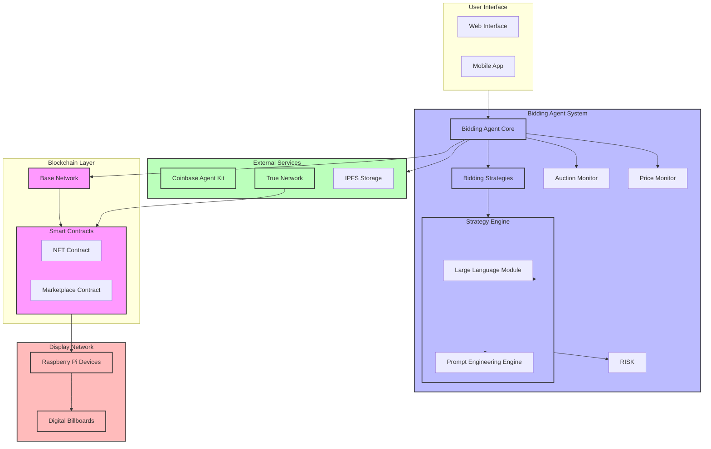

# AgenticPlaceholder Bidding Agent

## System Architecture

Our bidding agent system utilizes a sophisticated multi-layered architecture that ensures efficient, automated, and reliable ad placement across the digital billboard network. The following diagram illustrates the system's key components and their interactions:

### Architecture Components

The system architecture consists of four main layers that work together seamlessly to provide automated ad bidding and placement:

1. Users can chat with the Publisher Agent. It extracts the necessariy details from the user's conversation to generate a Title,Text and an Image Description. The image description is then used to generate an image with DaLLE. Afterwards this Ad is published as an NFT.

2. Bidding Agent System serves as the intelligent core of our platform. The bidding agent continuously monitors market conditions, analyzes pricing trends, and executes optimal bidding strategies. It uses 4O-mini  for prediction, risk management for exposure control, and an optimization engine for precise bid timing and pricing.

3. Blockchain Layer, built on the Base network, manages all transactions and ad ownership through smart contracts. The NFT contract handles ad content ownership, while the marketplace contract manages the dutch auction mechanism for ad space allocation.

4. Display Network consists of Raspberry Pi devices connected to physical digital billboards. These edge nodes receive ad content directly from the blockchain and ensure timely display updates.

### Integration Points

The system leverages several external services for enhanced functionality:

- Coinbase Agent Kit provides the foundational framework for our autonomous bidding agent
- True Network's attestation layer ensures publisher accountability through reputation scoring
- IPFS delivers decentralized storage for ad content and metadata

### Data Flow

The architecture supports a streamlined data flow where:

1. Users input their advertising requirements through the interface.
2. The bidding agent processes these requirements and monitors market conditions
3. Smart contracts handle the auction mechanics and ownership verification
4. Display devices receive and showcase the winning advertisements
5. True Network validates performance metrics and updates reputation scores
